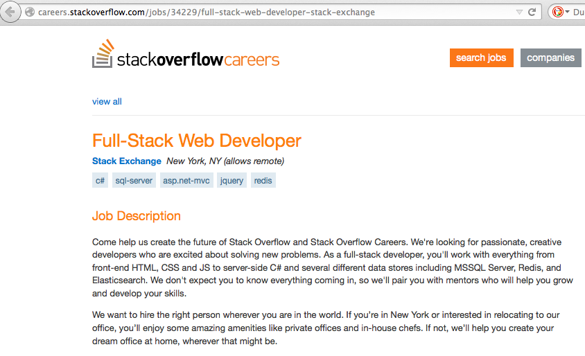
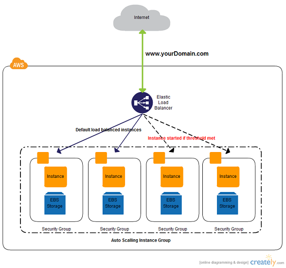

************
Introduction
************

Definition
==========

The industry definition of a Full Stack Developer is an engineer who can work on
different levels of an application stack.
The term stack refers to the combination of components and tools that make up the
application. The components could be in the front-end or the back-end of the system.

The main objective of full stack engineer is to keep every part of the system
running smoothly. A Full Stack Developer can performs tasks ranging from resizing an
image or text in a webpage to patching the kernel.

    This image shows a job position at `stackoverflow <http://stackoverflow.com/>`_ definition of the term.

Modern Application Architecture
===============================

Modern applications are developed to be installed on mobile devices or hosted
on the web. This is a result of trends in faster internet speeds, greater web
access and penetration, and the development of more powerful mobile devices.
This has created the need to rethink application development. Instead of an
isolated desktop or mobile application, modern applications have a distributed
back-end infrastructure interactively serving a variety of front-end clients
over the web.

System parts
------------

- Back-End
    - Operating System (OS)
    - Firewall
    - Web server
    - Database (SQL or NoSQL)
    - Caches
    - Message queuing software
    - Application
- Front-End
    - HTML
    - CSS
    - JavaScript
    - Dart

Modern Front-End frameworks
---------------------------

We have seen the big shift in the web from HTML 4 to HTML5 which has built-in
APIs to help you accomplish many tasks to built a richer web application.
This has resulted in a variety of front-end MVC frameworks such as:

- `Polymer <https://www.polymer-project.org/>`_
- `AngularJS <https://angularjs.org/>`_
- `React <http://facebook.github.io/react/index.html>`_

Modern Development Frameworks
-----------------------------

The changing computing world has led to and been led by
the fast growing world of web development frameworks such as:

- `NodeJS <http://nodejs.org/>`_
- `Django <https://www.djangoproject.com/>`_
- `RoR <http://rubyonrails.org/>`_
